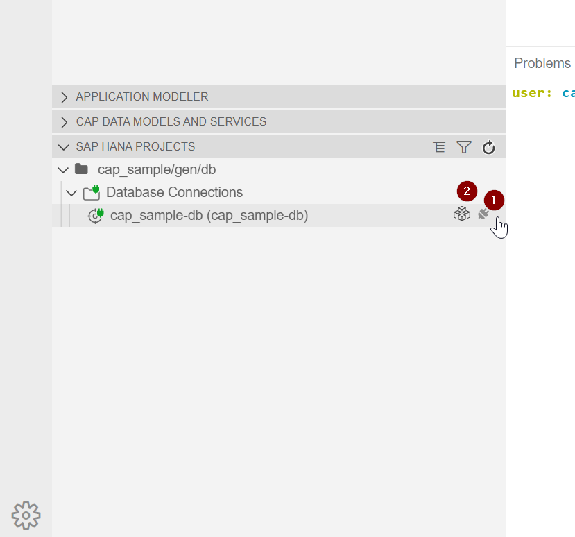

# Getting Started

Welcome to your new project.

It contains these folders and files, following our recommended project layout:

File or Folder | Purpose
---------|----------
`app/` | content for UI frontends goes here
`db/` | your domain models and data go here
`srv/` | your service models and code go here
`package.json` | project metadata and configuration
`readme.md` | this getting started guide


## Next Steps

- Open a new terminal and run `cds watch` 
- (in VS Code simply choose _**Terminal** > Run Task > cds watch_)
- Start adding content, for example, a [db/schema.cds](db/schema.cds).


## Learn More

Learn more at https://cap.cloud.sap/docs/get-started/.

## Description

### Init

- Start from Template -> CAP Project
- Choose Add Example files
- Project Structure:
  - .vscode -> run configs that can be used in VS Code
  - app -> for fiori implementations
  - db -> entity development in cds and/or HANA native
  - srv -> service defitions, service handler
  - .cdsrc.json -> cds project settings/structure
  - .eslinttrc -> linting options
  - .gitignore -> config for git
  - mta.yaml -> Deployment descriptor for CF
  - package.json -> npm package config, important
  - CAP Data Models view (bottom left)

### Test Service

```npm i && cds run```

### DB

First login to CF with ```cf login```

- deployment to CF HANA:
  ```cds deploy --to hana:cap_sample-db```
-> Runs into an Error for HANA Cloud

Add this to package.json if you use a HANA Cloud

```json
"cds": {
    "hana": {
      "deploy-format": "hdbtable",
      "syntax": "hdi"
    },
    "requires": {
      "db": {
        "kind": "sql"
      }
    }
  }
```

- SAP HANA Projects -> Bind cap_sample-db to local project
- Open DB Explorer:
  If the BAS HANA Tools are active, you can bind your just created HANA Instance to your BAS project.
  First click on Bind instance and choose your HANA Instance. Then click on open HDI Container to navigate to the DB Explorer.
  


### Service

Now push the service to the cloud:

- ```cds build --production```
- Navigate to gen/srv and run
- ```cf push```

#### Custom handler

- Add cat-service.js to your srv folder, e.g.

```js
const cds = require('@sap/cds')
const { Books } = cds.entities ('sap.capire.bookshop')

class CatalogService extends cds.ApplicationService { init(){

  // Add some discount for overstocked books
  this.after ('READ','Books', each => {
    if (each.stock > 111) {
      each.title += ` -- 11% discount!`
    }
  })

  return super.init()
}}

module.exports = { CatalogService }

```

## MTA

If we don't want to push both modules separatly, we can define a descriptor file for muli-target applications

Add mta.yaml file:

```cds add mta```

- Build MTA with ```mbt build```
- Deploy MTA with ```cf deploy mta_archives/cap_sample_1.0.0.mtar```

### UI

Add a Fiori Elements App to Project:

1. Create Destination for srv in SCP
   - Add additional properties 
   - WebIDEEnabled: true
   - WebIDEUsage: odata_abap,dev_abap,abap_cloud
2. Create MTA Module from Template
    - Choose Approuter
    - Choose managed App router -> UI planned -> Yes
3. Create Project from template
   - Choose Sap Fiori Application
   - SAP Fiori Elements
   - List Report/Worklist
   - Connect to local CAP Project
   - Choose service + entity
   - Add deployment + FLP config
   - For deployment descriptor choose the destination you created in step 1
   - Choose FLP Launchpad naming and finish

- In the app extend webapp/annotation.cds, for example with:

```SQL
annotate service.Books with @(UI : {
    SelectionFields : [title],
    LineItem        : [
    {
        Value : title,
        Label : 'Title'
    },
    {
        Value : stock,
        Label : 'Stock'
    }
    ]
});
```

- Show locally with ```cds run```
- Deploy with ```mbt build && cf deploy mta_archives/cap_sample_1.0.0.mtar```
- Get deployed URL: ```cf html5-list -di cap_sample-destination-service -u```

### Secure Service

- Add package:
 ```npm install passport```

- Add Dummy Auth to cds section of package.json:

```json
"auth": {
    "strategy": "dummy"
  }
```

- Change ```service CatalogService @(requires: 'system-user'){...}``` in Service definition
- Add Basic Auth with client_id and client_secret to Destination

## Git

1. Go to Github an create new repo
2. Follow steps in the description:
   - ```git init```
   - ```git branch -M main```
   - ```git add .``` or use git panel
   - ```git commit -m "First commit"```
   - ```git remote add origin https://github.com/chuckberrry/cap-sample.git```
   - ```git push -u origin main```
